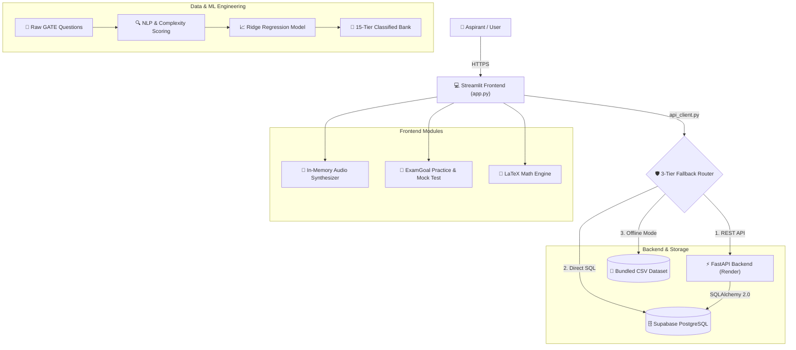

# ⛏️ FutureMining — GATE Mining Engineering Platform

[](https://futuremining.streamlit.app/)
[](https://futuremining-1.onrender.com/health)
[](https://supabase.com)
[](https://python.org)
[](https://scikit-learn.org/)
[](LICENSE.md)

> **FutureMining** is a full-stack, gamified learning and exam preparation platform built specifically for **GATE Mining Engineering** aspirants. It combines an interactive, high-stakes game-show format (*Kaun Banega Crorepati* style) with rigorous official GATE-pattern timed mock tests, dynamic analytics, and machine learning difficulty calibration.

---

## 🌟 Key Features

### 🎮 1. The Knowledge Challenge (KBC Mode)
- **15 Progressive Difficulty Tiers**: Questions scale from ₹1,000 up to ₹1,00,00,000 (1 Crore), perfectly aligned with our 15-level NLP difficulty model.
- **Milestone Safe Havens**: Guaranteed prize checkpoints at Level 5 (₹10,000) and Level 10 (₹3,20,000).
- **Interactive Lifelines**:
  - **50:50**: Eliminates two incorrect options.
  - **Flip / Swap Question**: Swaps the current question with a fresh server-verified question of the exact same difficulty level.
  - **Ask the Audience / AI Expert**: Generates intelligent probabilistic distributions weighted by question complexity.
  - **Double Dip**: Grants two attempts to lock in the correct answer.
- **Procedural Game-Show Sound Engine**: Synthesizes custom harmonic audio cues (clock ticks, tension hums, lock chimes, win fanfares) directly in-memory using pure Python with zero heavy audio file dependencies.
- **Rich LaTeX Rendering**: High-fidelity mathematical and chemical notation for complex mining formulas, matrices, and units.

---

### 📝 2. ExamGoal Practice & Timed Mock Tests
- **Authentic GATE Pattern**: Full-scale simulation adhering to official GATE marking (+1.0 Mark for correct answers, -0.33 negative marking for incorrect answers).
- **Interactive Question Palette**: Color-coded tracking for *Answered*, *Not Answered*, *Marked for Review*, and *Not Visited*.
- **Topic-Wise Practice**: Drill into dedicated mining modules including *Mine Ventilation, Opencast Mining, Rock Mechanics, Mine Legislation, Mining Machinery, and Engineering Mathematics*.
- **Crowdsourced Review Queue**: Users can flag ambiguous or errant questions in real-time, instantly persisting reports for administrative quality moderation.

---

### 🧠 3. Machine Learning Difficulty Pipeline
Questions are calibrated using a custom **NLP & Linguistic Feature Ensemble**:
- **Domain Lexicon Analysis**: Scans for 100+ mining engineering keywords (*longwall, room and pillar, UCS, powder factor, semivariogram, kriging, Atkinson's friction law*).
- **Readability & Complexity Metrics**: Incorporates Gunning Fog index, Flesch-Kincaid grade level, syllable counts, mathematical operator frequency, and character Shannon entropy.
- **TF-IDF + Ridge Regression**: Predicts continuous difficulty scores using combined word and character n-grams, subsequently mapped into **15 calibrated quantile tiers**.

---

### 🛡️ 4. Multi-Tier Resilient Architecture
Built for continuous availability with automatic three-tier fallback routing:
1. **Tier 1 (FastAPI REST Backend)**: Primary high-speed API hosted on Render with automated cold-start wake-up pings.
2. **Tier 2 (Direct Database Fallback)**: Transparent failover to direct pooled PostgreSQL connections (Supabase) via SQLAlchemy and `pg8000`.
3. **Tier 3 (Local Offline Mode)**: Bundled verified CSV dataset (`GATE_800_Questions_Classified.csv`) ensuring gameplay even without internet or cloud availability.

---

## 🏗️ System Architecture



---

## 📂 Project Structure

```bash
FutureMining/
├── app.py                     # Main Streamlit application & KBC game engine
├── api_client.py              # 3-tier resilient client (FastAPI -> DB -> CSV)
├── examgoal.py                # ExamGoal practice mode, mock test & analytics
├── requirements.txt           # Frontend dependencies
├── Procfile                   # Process file for cloud deployment
├── render.yaml                # Render Infrastructure-as-Code blueprint
│
├── backend/                   # FastAPI Backend Service
│   ├── main.py                # API routing, authentication & game logic
│   ├── models.py              # SQLAlchemy database ORM models
│   ├── schemas.py             # Pydantic request/response schemas
│   ├── database.py            # PostgreSQL connection pool configuration
│   ├── requirements.txt       # Backend dependencies
│   └── Dockerfile             # Container configuration
│
├── data/                      # Dataset & Moderation Queue
│   ├── GATE_800_Questions_Classified.csv   # 800 ML-classified questions (Tiers 1-15)
│   ├── GATE_800_Questions_Raw.csv          # Raw questions before classification
│   └── review_queue.json                   # Local fallback moderation queue
│
├── models/                    # Trained Machine Learning Models
│   ├── gate_difficulty_model.pkl
│   └── gate_nlp_model.pkl
│
└── util/                      # ML & Data Pipeline Scripts
    ├── classification_pipeline.py  # NLP feature engineering & Ridge training
    ├── generate_dataset.py         # LLM-guided syllabus question generation
    ├── integrity_check.py          # Automated database integrity audit
    └── test_env.py                 # Environment verification utility
```

---

## 🚀 Getting Started

### Prerequisites
- Python 3.10 or higher
- Git
- (Optional) PostgreSQL database instance or free [Supabase](https://supabase.com) project

### 1. Clone the Repository
```bash
git clone https://github.com/tysonfgh/FutureMining.git
cd FutureMining
```

### 2. Frontend Setup (Streamlit)
```bash
# Create and activate a virtual environment
python -m venv venv
source venv/bin/activate  # On Windows: venv\Scripts\activate

# Install dependencies
pip install -r requirements.txt

# Run the Streamlit application
streamlit run app.py
```

### 3. Backend Setup (FastAPI - Optional for local development)
```bash
# In a separate terminal
cd backend
pip install -r requirements.txt

# Configure your environment variables (.env)
# DATABASE_URL=postgresql+pg8000://<user>:<password>@<host>:<port>/postgres

# Launch FastAPI server
uvicorn main:app --host 127.0.0.1 --port 8000 --reload
```

---

## 🔌 API Endpoints Reference

The FastAPI backend exposes comprehensive RESTful services documented interactively at `/docs` (Swagger UI):

| Method | Endpoint | Description |
| :--- | :--- | :--- |
| `GET` | `/health` | Service health status and live question count |
| `POST` | `/api/auth/register` | Register user account with salted password hashing |
| `POST` | `/api/auth/login` | Authenticate user and issue session profile |
| `GET` | `/api/questions` | Query questions filtered by subject, topic, or difficulty |
| `GET` | `/api/topics` | Retrieve all mining topics and active question counts |
| `GET` | `/api/game/ladder` | Fetch 15-question progressive game show ladder |
| `GET` | `/api/game/swap` | Lifeline: Securely swap a question for a given level |
| `POST` | `/api/game/verify` | Server-side secure answer verification |
| `POST` | `/api/progress/attempt` | Log question attempt for performance analytics |
| `POST` | `/api/progress/test-session` | Save complete timed mock test session results |
| `GET` | `/api/progress/{user_id}/summary` | Retrieve comprehensive user performance analytics |
| `POST` | `/api/reviews/flag` | Flag a question for administrative review |

---

## 👥 The Team

This project was conceived, designed, and developed collaboratively by:

| Team Member | Role & Key Contributions | LinkedIn |
| :--- | :--- | :--- |
| **Sayandeep Guin** | **Frontend Development** — Streamlit UI/UX design, custom styling, game show flow, and responsive components | [](https://www.linkedin.com/in/sayandeep-guin-041576356/) |
| **Sabuj Kishore Mondal** | **Frontend Development** — UI mechanics, interactive question palette, ExamGoal mock tests, and audio synthesis | [](https://www.linkedin.com/in/sabuj-m-392855381/) |
| **Sagar Pal** | **Database Architecture** — Schema modeling, PostgreSQL integration on Supabase, data migrations, and integrity audits | [](https://www.linkedin.com/in/sagar-pal-681912383/) |
| **Arpita Sengupta** | **Backend Architecture** — FastAPI development, REST API design, multi-tier fallback routing, auth & cloud deployment | [](https://www.linkedin.com/in/arpita-sengupta-4085913ab/) |

---

## 📜 License

This project is licensed under the MIT License - see the [LICENSE.md](LICENSE.md) file for details.
